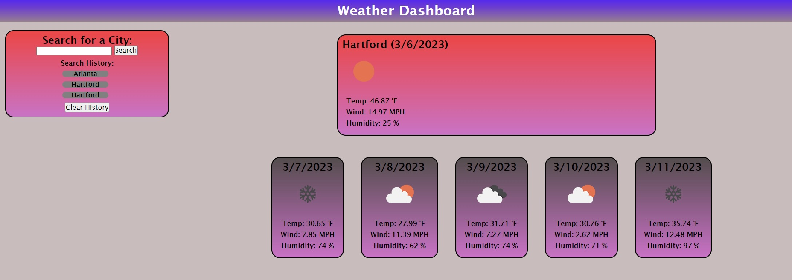
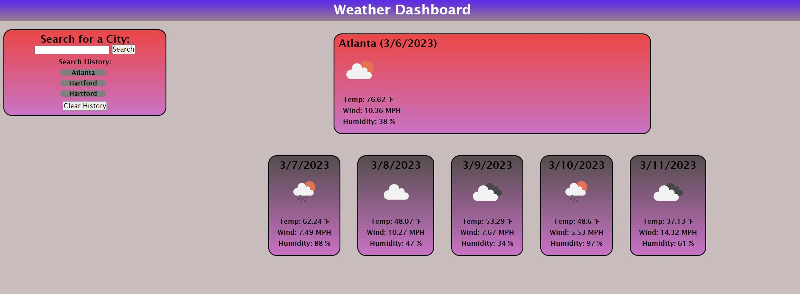
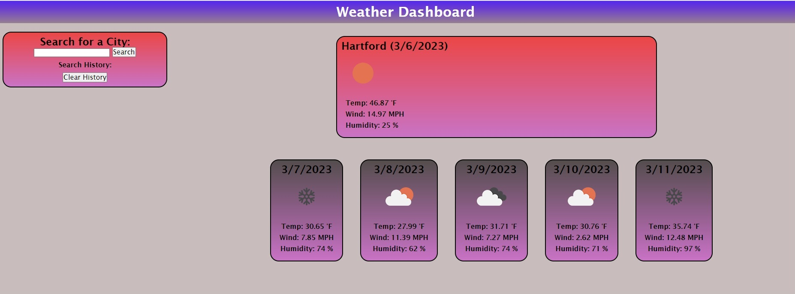

# Weather-Dashboard

## Description

Created a Weather Dashboard where users are able to get the current weather, as well as the 5-day forecast for cities they look up using the search functionality. It also has the ability to save previous searches and display the weather for any selected search history item. You can also clear the search history list if desired.

Published website:  https://molyneauxk93.github.io/KevinMolyneaux-Weather-Dashboard-Challenge/

## Installation

N/A

## Usage

Use Kevin Molyneaux's Weather Dashboard to ensure that you are always prepared. No matter what the weather throws at you!

## Credits

N/A

## License

MIT License - Please refer to the LICENSE in the repo.

## Usage
The following image shows the first page of the Weather Dashboard. This page just consists of the search box for the users initial search.

The follwing image shows the second page that loads when a search is performed on the first page, here the current weather and 5 day forecast are displayed and a search history item is logged below the search input.

The following image shows the search history function when I selected 'Atlanta' in the search history. As you can see the page refreshed with the current and future weather for Atlanta. 

The following image shows the Weather Dashboard without a search history list after I opted to clear the search history using the clear history button. 

